---
title: Memory
level: Scratch 2
language: fr-FR
stylesheet: scratch
embeds: "*.png"
materials: ["Club Leader Resources/*"]
...
stylesheet: scratch
embeds: ".png"
materials: ["Club Leader Resources/.*"]
base: https://github.com/CodeClub/scratch-curriculum/blob/master/en-GB/Term%202/Memory/Memory.md

translators: Eve,
reviewer:
status: free ...

## Community Contributed Project { .challenge .pdf-hidden }
Ce projet a été créé par Erik et sa fille Ruth. Si vous souhaitez apporter votre propre contribution, alors [Contactez nous sur Github](https://github.com/CodeClub).

# Introduction { .intro }

Dans ce projet, tu vas créer un "memory game", un jeu de mémoire, dans lequel il faut mémoriser et répéter une séquence de couleurs produite au hasard!

<div class="scratch-preview">
  <iframe allowtransparency="true" width="485" height="402" src="http://scratch.mit.edu/projects/embed/34874510/?autostart=false" frameborder="0"></iframe>
  
</div>

# Etape 1: Des couleurs au hasard { .activity }

D'abord, il faut créer un objet qui peut changer de couleur au hasard, afin que le joueur ait quelque chose à mémoriser.

## Liste de choses à faire { .check }

+ Ouvre un nouveau projet Scratch et supprime le lutin de chat, de façon à ce que le projet soit vide. Tu peux trouver l'éditeur en ligne de Scratch à cette adresse : <a href="http://jumpto.cc/scratch-new">jumpto.cc/scratch-new</a>.

+ Choisi un objet et place-le. Cet objet peut être un personnage ou autre chose, mais il doit pouvoir changer de couleur.

	

+ Dans ton jeu, tu vas utiliser un chiffre différent pour chaque couleur :

	+ 1 = rouge ;
	+ 2 = bleu ;
	+ 3 = vert ;
	+ 4 = jaune.

	Donne à ton objet 4 costumes de couleur différente. Attention que tes costumes soient dans le bon ordre de couleur.

	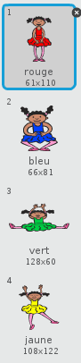

+ Pour créer un changement au hasard, tu as besoin de créet une __list__. Une liste est une variable qui comporte des données __dans l'ordre__. Crée une nouvelle liste appelée `sequence` {.blockdata}. Comme seul ton objet a besoin de voir la liste, tu peux cliquer sur  'Pour ce lutin uniquement'.

	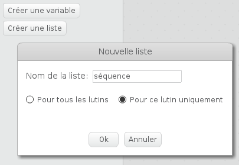

	Tu dois maintenant voir ta liste vide à gauche de ta scène, ainsi que beaucoup de nouveaux blocs pour l'utilisation de listes.

	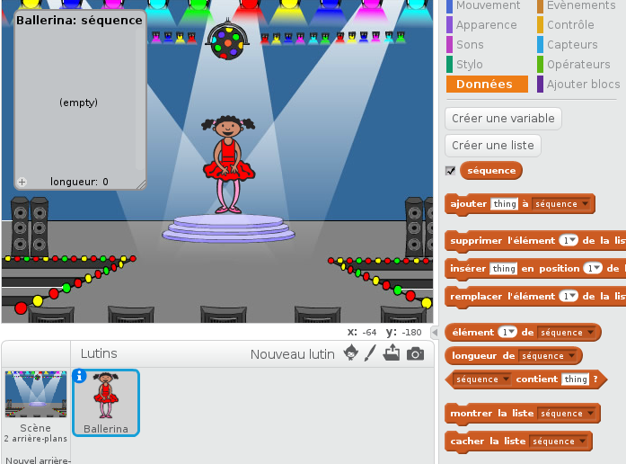

+ Ajoute ce script à ton objet, pour ajouter un chiffre au hasard à ta liste (et regarde le bon costume) 5 fois :

	```blocks
		when flag clicked
		delete (all v) of [sequence v]
		repeat (5)
			add (pick random (1) to (4)) to [sequence v]
			switch costume to (item (last v) of [sequence v]
			wait (1) secs
		end
	```

	Note que tu as également vidé la liste pour commencer.

## Challenge: ajouter le son {.challenge}
Testes ton projet plusieurs fois. Tu remarques que parfois le même numéro est choisi deux (ou plusieurs) fois dans la même séquence, ce qui la rend plus difficile à mémoriser. Peux-tu ajouter un bruit de tambour chaque fois que le personnage change de costume?

Peux-tu ajouter un bruit différent selon le numéro choisi au hasard? Ce devrait être _très_ proche du code utilisé pour changer de couleur.

## Sauvegarde ton projet { .save }

# Etape 2: Répéter la séquence { .activity }

Maintenant, ajoute 4 boutons pour que le joueur indique la séquence dont il se souvient.

## Liste d'activités { .check }

+ Ajoute 4 lutins à ton projet, qui deviendront les 4 boutons (ça peut être des tambours, comme dans l'illustration, ou n'importe quel autre objet que tu choisis dans le catalogue de lutins de Scratch. Tu peux même faire tes propres lutins). Modifie tes 4 lutins de façon à ce qu'il y en ait un pour chacune des couleurs.

	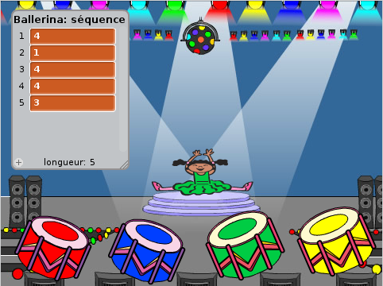

+ Quand le bouton rouge est cliqué, tu dois envoyer un message à ton objet, pour lui faire savoir que le bouton rouge a été cliqué. Ajoute ce code à ton bouton rouge:

	```blocks
		when this sprite clicked
		broadcast [red v]
	```

+ Quand ton objet reçoit ce message, il doit vérifier si le numéro 1 est au début de la liste (ce qui signifie que le rouge est la couleur suivante dans la séquence). Si oui, vous pouvez supprimer le numéro de la liste car il a été deviné correctement. Sinon, il y a game over.

	```blocks
		when I receive [red v]
		if <(item (1 v) of [sequence v])=[1]> then
			delete (1 v) of [sequence v]
		else
			say [Game over!] for (1) secs
			stop [all v]
		end
	```

+ Tu peux également afficher certains clignotants quand la liste est vide, pour montrer que toute la séquence a été correctement mémorisée. Ajoute ce code à la fin du script `quand drapeau cliqué` {.blockevents} :

	```blocks
		wait until < (length of [sequence v]) = [0]>
		broadcast [won v] and wait
	```

+ Clique sur ta scène, et ajoute ce code pour que la couleur de l'arrière-plan change une fois que le joueur a gagné.

	```blocks
		when I receive [won v]
		play sound [drum machine v]
		repeat (50)
			change [color v] effect by (25)
			wait (0.1) secs
		end
		clear graphic effects
	```

## Challenge: Créer 4 boutons {.challenge}
Répétez les étapes ci-dessus pour vos boutons bleus, verts et jaunes . Quel code reste le même, et quel code va changer pour chaque bouton ?

Tu peux alors ajouter des sons quand le bouton est pressé.

N'oublie pas de tester le code que tu as ajouté! Peux-tu mémoriser une séquence de 5 couleurs? La séquence est-elle différente à chaque fois?

## Sauvegarde ton projet { .save }

# Etape 3: Créer plusieurs niveaux { .activity .new-page }

Jusqu'à présent, le joueur ne doit se rappeler que de 5 couleurs . Maintenant, nous allons améliorer le jeu, de sorte que la longueur de la séquence augmente.

## Liste d'activités { .check }

+ Crée une nouvelle variable appelé `score` {.blockdata}, pour tous les lutins.

	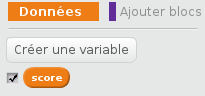

+ Ce `score` {.blockdata} sera utilisé pour déterminer la longueur de la séquence que le joueur devra mémoriser. Donc, pour commencer, le score (et la longueur de la séquence) est 3. Ajoute ce bloc de code au début de `quand drapeau cliqué` {.blockevents} de ton objet:

	```blocks
		set [score v] to [3]
	```

+ Au lieu de créer toujours une séquence de 5 couleurs, tu veux maintenant utiliser le  ` score` { } .blockdata pour déterminer la longueur de la séquence. Change la boucle ` répéter` { } .blockcontrol de ton objet (pour la création de la séquence) en:

	```blocks
		repeat (score)
		end
	```
+ NB. le block `score` doit être inséré dans le block `répéter X fois` à la place du nombre de fois.
+ Si la séquence est correctement mémorisée, il faut ajouter 1 au score, pour augmenter la longueur de la séquence.

	```blocks
		change [score v] by (1)
	```

+ Pour finir, tu dois ajouter la boucle `forever` {.blockcontrol} autour du bloc de code pour générer la séquence, de sorte qu'une nouvelle séquence est créée pour chaque niveau. Voici à quoi le code de ton objet devrait ressembler:

	```blocks
		when flag clicked
		set [score v] to [3]
		forever
			delete (all v) of [sequence v]
			repeat (score)
				add (pick random (1) to (4)) to [sequence v]
				switch costume to (item (last v) of [sequence v]
				wait (1) secs
			end
			wait until < (length of [sequence v]) = [0]>
			broadcast [won v] and wait
			change [score v] by (1)
		end
	```

+ Demande à tes amis de tester ton jeu. N'oublie pas de cacher la séquence` { } .blockdata liste ` avant qu'ils jouent!

## Sauvegarde ton projet { .save }

# Etape 4: Meilleur score { .activity }

Maintenant sauvegarde le meilleur score afin de pouvoir jouer avec tes amis.

## Liste d'activités { .check }

+ Ajoute 2 nouvelles variables à ton projet, que tu vas appeler `high score` {.blockdata} et `name` {.blockdata}.

+ Si jamais le jeu se finit (en appuyant sur le mauvais bouton), tu dois vérifier si le score du joueur est meilleur que le meilleur score actuel. Dans ce cas, tu dois enregistrer le score en tant que le meilleur score, et stocker le nom du joueur. Voici à quoi ton bouton rouge devrait ressembler:

	```blocks
		when I receive [red v]
		if <(item (1 v) of [sequence v])=[1]> then
			delete (1 v) of [sequence v]
		else
			say [Game over!] for (1) secs
			if < (score) > (high score) > then
				set [high score v] to (score)
				ask [High score! What is your name?] and wait
				set [name v] to (answer)
			end
			stop [all v]
		end
	```

+ Tu as besoin d'ajouter ce nouveau code pour les 3 autres boutons aussi! As-tu remarqué que le code ' Game over ' de chacun des 4 boutons est exactement le même?

	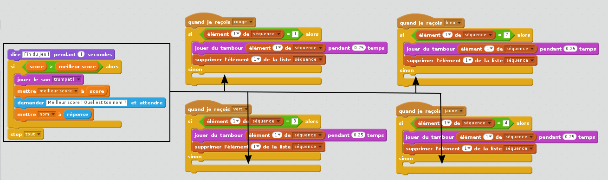

+ Si jamais tu as besoin de changer tout de ce code, comme l'ajout d'un son ou changer le message ' Game over '!, tu dois le changer 4 fois! Cela peut parfois être ennuyeux et te faire perdre beaucoup de temps.

Au lieu de ça, tu peux définir tes propres blocs, et les réutiliser dans ton projet! Pour ce faire, clique sur ` plus blocks` { } .blockmoreblocks , puis ' Ajouter un bloc '. Appelle ce nouveau bloc ' Game Over '.

	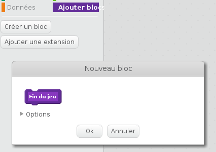

+ Ajoute le code du block `else` {.blockcontrol} du bouton rouge comme nouveau bloc:

	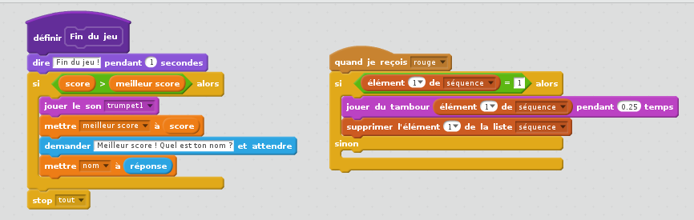

+ Tu as fait une _nouvelle_fonction appelée `Game over` {.blockmoreblocks}, que tu peux réutiliser partout. Ajoute ton nouveau bloc  `Game over` {.blockmoreblocks} aux 4 scripts des 4 autres boutons.

	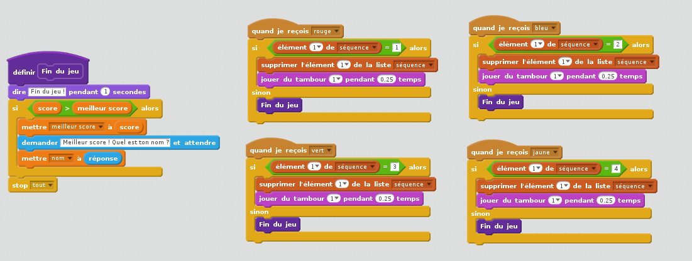

+ Maintenant ajoute un son pour quand le mauvais bouton est pressé. Tu as seulement besoin d'ajouter ce bloc de code _once_ in the `Game over` {.blockmoreblocks} que tu as fait, et pas de le faire 4 fois!

	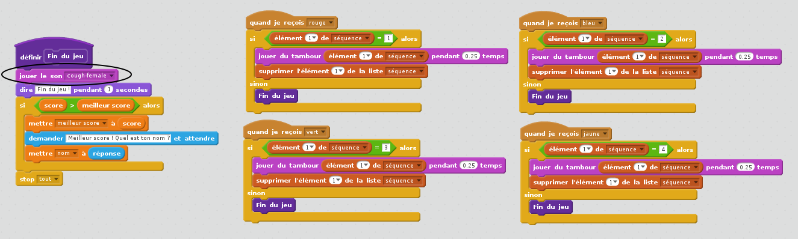

## Challenge: Fais plus de blocs {.challenge}
As-tu remarqué d'autres blocs de code qui seraient les mêmes pour les 4 boutons?

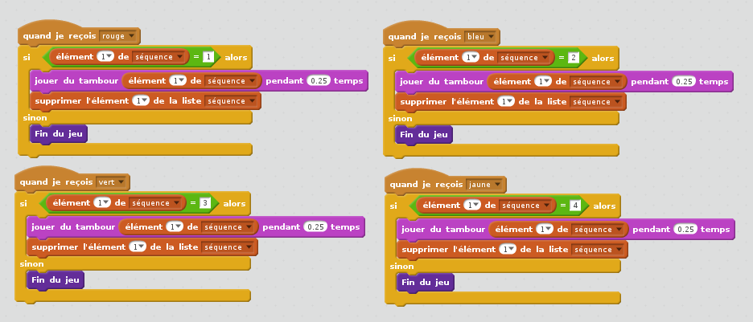

Peux-tu faire un autre bloc qui serait utilisé par chaque bouton?

## Sauvegarde ton projet { .save }

## Challenge: Autre costume {.challenge}
Tu as remarqué que le jeu commence avec un objet coloré de l'une des 4 couleurs et que la dernière couleur de la séquence s'affiche quand le joueur répète la séquence ?

Peux-tu ajouter un autre costume blanc uni à ton objet, qui sera affiché au début de ton jeu, et quand le joueur essaye de copier la séquence ?

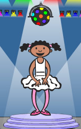

## Sauvegarde ton projet { .save }

## Challenge: Niveau de difficulté {.challenge}
Peux-tu permettre au joueur de choisir entre facile 'easy mode' (seulement les boutons rouge et bleu) et le mode normale 'normal mode' (qui utilises tous les 4 boutons)?

Tu peux même ajouter un mode difficile, qui aura un 5e bouton!

## Sauvegarde ton projet { .save }
